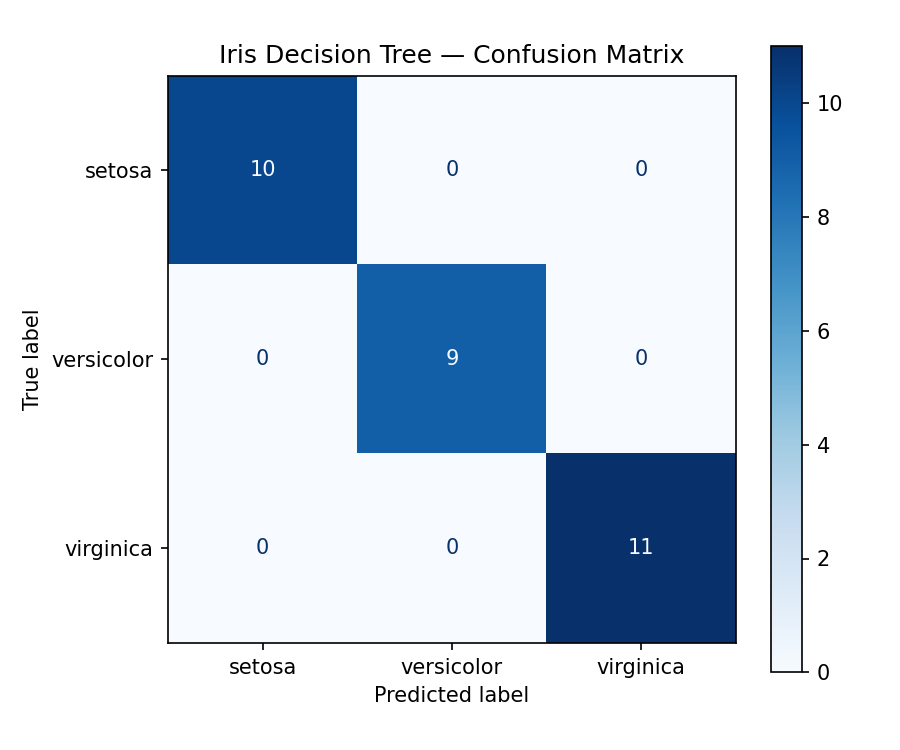

# Iris Classifier

End-to-end Iris decision tree ML example for AI Fundamentals course assessment.

A supervised machine-learning project that trains a Decision Tree classifier to predict the species of an Iris flower (setosa, versicolor, or virginica) from four measurements: sepal length, sepal width, petal length, and petal width. Built with scikit-learn following the standard workflow: prepare data → train → predict → evaluate → interpret.

## Project structure

```
irisclassifier/
├── data/
│   └── iris.csv                 # local copy of the Iris dataset
├── notebooks/
│   └── iris_model.ipynb         # step-by-step notebook with explanations
├── src/
│   └── train.py                 # CLI script: trains, evaluates, saves figure
├── tests/
│   └── test_train.py            # asserts accuracy >= 0.9
├── outputs/
│   ├── confusion_matrix.png     # generated by src/train.py
│   └── iris_model.joblib        # trained model exported by src/train.py
├── .gitignore
├── LICENSE
├── README.md
└── requirements.txt
```

## Setup

Requires Python >= 3.9.

```bash
python -m venv .venv
source .venv/bin/activate        # Windows: .venv\Scripts\activate
pip install -r requirements.txt
```

## Usage

Run the training script:

```bash
python src/train.py
```

It prints the accuracy and classification report, saves the confusion matrix to `outputs/confusion_matrix.png`, and exports the trained model to `outputs/iris_model.joblib` (the folder is created programmatically).

Reuse the trained model later without retraining:

```python
import joblib

model = joblib.load("outputs/iris_model.joblib")
prediction = model.predict([[5.1, 3.5, 1.4, 0.2]])  # -> setosa (0)
```

Or open the notebook:

```bash
jupyter notebook notebooks/iris_model.ipynb
```

## Results

With an 80/20 train/test split (`random_state=42`, 120 train / 30 test samples), the decision tree classifies **all 30 test samples correctly (accuracy = 1.00)**. Results in the 95–100% range are expected for this dataset; setosa is perfectly separable by petal length, while versicolor and virginica are occasionally confused on other splits. Petal length and petal width are the most important features, matching botanical intuition.



## Testing

```bash
pytest
```

The tests assert that the model reaches at least 90% accuracy on the test set, and that the exported `outputs/iris_model.joblib` loads and predicts correctly without retraining.

## Reproducibility

The train/test split and the tree use `random_state=42`, so every run produces the same result. The dataset is stored locally at `data/iris.csv` (auto-regenerated from scikit-learn if missing).

## License

MIT — see [LICENSE](LICENSE).
